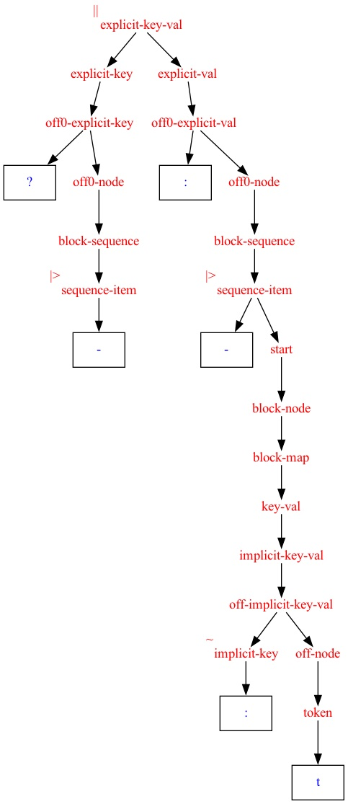
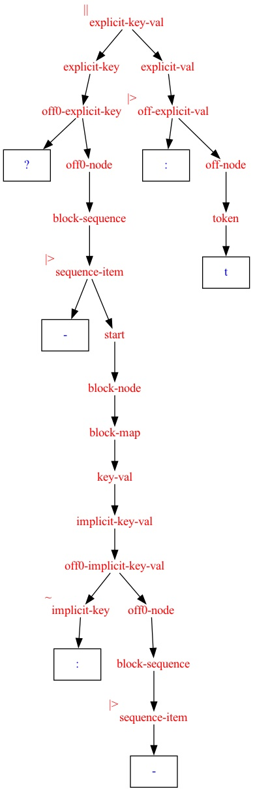

# Artifact of paper "Automated Ambiguity Detection in Layout-Sensitive Grammars"

This is the artifact for the paper "Automated Ambiguity Detection in Layout-Sensitive Grammars" at OOPSLA'23. The main purpose of this artifact is to support our evaluation results in §7 (mostly Table 1) and the theoretical results in §3 -- §5 (the main conclusions are Theorem 5.9 and Theorem 5.10).

This artifact consists of two parts (each is a directory):

1. `tool/`: our prototype tool that implements the ambiguity detection approach (following §5), together with necessary data and scripts for reproducing the evaluation (§7);
2. `proof/`: our Coq mechanization (§6) of all the definitions and theorems mentioned in §3 -- §5.

## 1 Getting Started Guide (10 min)

### 1.1 Building Lamb (3 min)

Change the directory to `tool/`. We provide two options to set up the environment and you should choose **either**:

- (1.1a) via [Nix](https://nixos.org/download.html) (version 2.15.1 is tested; latest recommended)
- (1.1b) via Docker

NOTE: As far as we know, Nix (1.1a) is a better option because:

+ you can easily view the images of parse trees via any document/figure preview applications installed on your machine (instead of a virtual machine typically with text UI only);
+ you can use whatever Coq IDEs to step into the Coq proofs, if necessary.

For Windows users, WSL2 is a possible way to install and run Nix. However, if you find difficulties in installing Nix, Docker (1.1b) is the secondary option where you will only be able to view parse trees in S-expression format.

#### 1.1a Via Nix

If you haven't installed Nix, type the following command to do so in your shell:

```bash
curl --proto '=https' --tlsv1.2 -sSf -L https://install.determinate.systems/nix | sh -s -- install
```

Type `nix --version` to make sure `nix` is installed and can be found in the current PATH. In the `tool/` directory, run the following to build our tool:

```bash
nix build --no-link
```

The building process should take no more than 15 minutes. If encountering an error message requesting to enable the experimental features of Nix, refer to [this guide](https://nixos.wiki/wiki/Flakes#Enable_flakes) to enable flakes and Nix commands.

#### 1.1b Via Docker

If you haven't installed Docker, follow [this link](https://docs.docker.com/desktop/install/linux-install/) (you should select the one that matches your OS) to install Docker Desktop and start it.

In the `tool/` directory, run the following to build a Docker image:

```bash
docker build . -t lamb:0.0.0
```

Then, start a container using that image, so that you will be dropped into the development shell:

```bash
docker run -it lamb:0.0.0
```

Your shell prompt should now end with `[lamb-dev]>`.

### 1.2 Testing the Motivating Example (4 min)

Once you have successfully built Lamb, we are ready to test the motivating example mentioned in §2. We use a slightly different (plain text) syntax to describe EBNF in our tool (file extension `.bnf`):

- `A|>` for offside on `A`
- `A>>` for offside-align on `A`
- `A~` for single on `A`
- `A || B` for `A` align `B`
- `A -> B` for `A` indent `B`

The grammar $G_\textsf{block}$ in §2 is encoded in the file `tests/motivating-example.bnf` using the above syntax. To detect ambiguity in this grammar, execute the following (in directory `tools/`):

```bash
nix run . -- tests/motivating-example.bnf
```

**Alternatively**, you can enter the Nix development shell via `nix develop` and execute `python -m lamb tests/motivating-example.bnf` there.

The expected output looks like below:

```
...lines of solving process omitted...

***
Ambiguous sentence of length 3 found. It shall be listed below.
***

do
nop
nop

***
Found locally ambiguous variable: "new-var-0". It corresponds to token(s) [1, 3] in the ambiguous sentence.
***

NOTE: indexing for tokens in the sentence starts at 1. Spaces in the sentence are denoted as `␣'.
NEXT STEP: Review all parse trees using the following commands (execute line by line):

show tree new-var-0 0
show tree new-var-0 1

Type help for other available commands. Command completion available with TAB key.

Now entering REPL...

smt-ambig>
```

First, the output shows the produced ambiguous sentence, which has three tokens:

```
do
nop
nop
```

Second, the output provides hints on the commands required to view all parse trees rooted at given nonterminals. The command syntax is

```
show tree <nonterminal> <tree-index>
```

The nonterminal is the one in the transformed binary normal form (so it can be a fresh name not seen in the EBNF), but the parse trees will be presented in the original EBNF for ease of viewing. Here, `new-var-0` is the root of the two dissimilar subtrees (the nonterminal $H$ in our encoding $\Phi(k)$; see §5.2) we found and it happens to be the start symbol `block`. The benefit of showing dissimilar subtrees is to make it easier to see the differences between those trees (as mentioned in the paper, being dissimilar means "differ in a node at level 1").

Now, type the following two commands in our REPL

```bash
smt-ambig> show tree new-var-0 0
smt-ambig> show tree new-var-0 1
```

to view the two different parse trees. The S-expression form will always be printed to the console; additionally, a figure will be opened (via `open` for Mac or `xdg-open` for Linux) if a preview application has been installed on your OS. They resp. correspond to Fig. 1 (b) and (a) in the paper.

Finally, type `exit` to quit the REPL.

### 1.3 Checking the Coq Proof Artifact (3 min)

Change the directory to `proof/`. Likewise, we also provide two options to compile the Coq proof and you should choose **either**:

- (1.3a) via [Nix](https://nixos.org/download.html) (version 2.15.1 is tested; latest recommended)
- (1.3b) via Docker

#### 1.3a Via Nix

```bash
nix build
```

If no error messages show, then the theorems are all machine-checked.

#### 1.3b Via Docker

Build the docker image with the following command:

```bash
docker build . -t proof-artifact:0.0.0
```

If no error messages show and you see the following line (or something similar if you are using an older version):

```
 => => naming to docker.io/library/proof-artifact:0.0.0
```

Then the building succeeds and all theorems are machine-checked.

## 2 Step-by-Step Instructions for Reproducing Evaluations (36 min -- 2 h)

### 2.1 Looking at the Dataset (3 min)

The following table presents the location of the dataset listed in Fig. 6 (where the sub-index x = 0, 1, 2, 3, 4):

| #    | Lang    | Location                                             |
| ---- | ------- | ---------------------------------------------------- |
| #1-x | Python  | `tool/tests/checker-benchmark/python/x.bnf`          |
| #2-x | SASS    | `tool/tests/checker-benchmark/sass/x.bnf`            |
| #3-x | YAML    | `tool/tests/checker-benchmark/yaml/x.bnf`            |
| #4-x | F#      | `tool/tests/checker-benchmark/fsharp-snippet/x.bnf`  |
| #5-x | Haskell | `tool/tests/checker-benchmark/haskell-snippet/x.bnf` |

The EBNF files (`*.bnf`) are written in plain-text form, which is slightly different from the notation in the paper. See [step 1.2](#12-testing-the-motivating-example-4-min) for the conversion.

In each group, the first grammar (`0.bnf`) is the original (i.e., *seed*), while the other four are variants of the seed grammar. This is consistent with our evaluation setup mentioned in §7.1.

### 2.2 Running the Experiments (5 min - 1.5 h)

To reproduce our experiments, change the directory to `tool/` and enter the development shell via the following command (if using Docker, start the container via `docker run -it lamb:0.0.0` will directly bring you to the development shell):

```bash
nix develop
```

It loads all necessary dependencies (such as Python with all required packages, Z3, and Graphviz) into the PATH environment variable. Notice that after executing this command, the prompt line should now end with `[lamb-dev]>`, meaning the development shell has been activated.

For ease of running the experiments, we built a script `run_tests.py` that checks the grammars in parallel, collects the metrics, and saves the metrics to a file. Depending on how much time you can spend, choose **one** of the following options (from shortest to longest time spent):

- Enable option `--fastest`: check grammars #1-3, #2-1, #3-1, #4-1, and #5-4 only (i.e., the fastest one of each language group). This option conflicts with `--all`. (~5 min)
- No option: check all grammars excluding SASS and Python grammars. (~12 min)
- Enable option `--all`: check all grammars, including SASS and Python grammars. This option conflicts with `--fastest`. (1 -- 1.5 h, depending on the degree of parallelism of your machine)

Execute the following in the development shell, where `OPTION` is one of the above:

```bash
python run_tests.py OPTION
```

For example, the following command runs all the experiments:

```bash
python run_tests.py --all
```

Additionally, you may use the option `--timeout SECONDS` to customize how long (in seconds) we shall wait before killing the tool process (for each grammar) and recording the result as `TIMEOUT`. The default value is 3600 (1 hour)

When the script completes, metrics will be collected and saved to file `result.csv` under the current directory.

### 2.3 Checking the Results (3 min)

The results of step 2.2 have been saved to a CSV file `result.csv`. It has the same structure as Table 1 in the paper.

Note: Despite the randomness of the found satisfiable model by the Z3 solver, the lengths of the ambiguous sentence (i.e., the last column of Table 1) are determined (the found ambiguous sentences may differ).

### 2.4 Human Understanding of the Ambiguous Sentence (5 min)

This part presents how one can analyze the cause of ambiguity by inspecting the parse trees of the generated ambiguous sentence, as mentioned in §7.3. This is a minor result of our evaluation: skip this step if your time is tight.

In the development shell, run:

```bash
python -m lamb ./tests/checker-benchmark/yaml/2.bnf
```

As mentioned above, a different ambiguous sentence may be produced due to the randomness of the Z3 solver. In the following, we assume the generated ambiguous sentence is the one mentioned in Fig. 7. This is the expected output:

```
***
Ambiguous sentence of length 6 found. It shall be listed below.
***

␣␣␣␣␣␣␣␣␣␣␣␣␣␣␣␣?       ␣␣␣␣␣␣␣␣
-       ␣␣␣␣␣␣␣␣␣␣␣␣␣␣␣␣␣␣␣␣␣␣␣␣
␣␣␣␣␣␣␣␣␣␣␣␣␣␣␣␣:       ␣␣␣␣␣␣␣␣
␣␣␣␣␣␣␣␣-       ␣␣␣␣␣␣␣␣␣␣␣␣␣␣␣␣
␣␣␣␣␣␣␣␣␣␣␣␣␣␣␣␣:       ␣␣␣␣␣␣␣␣
␣␣␣␣␣␣␣␣␣␣␣␣␣␣␣␣␣␣␣␣␣␣␣␣t

***
Found locally ambiguous variable: "explicit-key-val". It corresponds to token(s) [1, 6] in the ambiguous sentence.
***

NOTE: indexing for tokens in the sentence starts at 1. Spaces in the sentence are denoted as `␣'.
NEXT STEP: Review all parse trees using the following commands (execute line by line):

show tree explicit-key-val 0
show tree explicit-key-val 1

Type help for other available commands. Command completion available with TAB key.

Now entering REPL...

smt-ambig>
```

To inspect the parse trees, run `show tree explicit-key-val 0` and `show tree explicit-key-val 1` in our REPL (as in step 1.2). The trees are the same as in Fig. 7:

|  |  |
| -------------------------------------- | -------------------------------------- |

As mentioned in §7.3: we see that in tree 0, the mapping key is a one-element list that contains exactly a null; in tree 1, however, the mapping key is a one-element list that is not null. To fix this issue, we could add the offside-align constraint to the right-hand side of `off0-explicit-key`, `off0-implicit-key-val`, and `off0-explicit-val`.

To sum up, the above process works to resolve (if not, at least our tool helps to understand the cause of) layout-sensitive ambiguity. Interesting readers are encouraged to repeat this process on other examples themselves.

### 2.5 Paper-to-Coq Correspondence Guide (~20 min)

Change the directory to `proof/`. Open `README.md` and read the chapter [Paper-to-Artifact Correspondence Guide](proof/README.md#paper-to-artifact-correspondence-guide). Optionally, if you wish to step into the proofs, launch your Coq IDE in the Nix development shell (via `nix develop`; see [Step Into the Code](proof/README.md#step-into-the-code) for more details).
